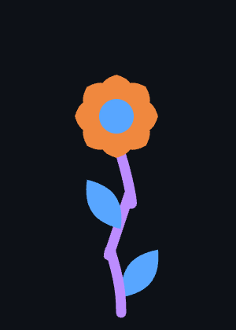

# knack! – Design

Game idea, design decisions, and learnings. Living document – updated as the project evolves.

→ See also: [CLAUDE.md](CLAUDE.md) (AI rules) · [README](README.md) (public)
→ knack! is the lab for: [../braind_dump/blumen-fuer-mutti.md](../braind_dump/blumen-fuer-mutti.md)

---

## Idea

A fidget game. A block appears – tap it until it breaks into shards. Sort the shards by **shape** into bins. Bins fill up, a crystal flower grows.

knack! is a prototype lab. We learn here what feels good – mechanics, animations, haptics, visual language – before building the actual game ("Blumen für Mutti").

**Inspiration:** Satisfying stone-breaking videos (TikTok/YouTube). Montessori shape sorters. The good part of mobile sorting games – without the dark patterns.

**Core question:** Does it feel good? Is sorting satisfying enough to be a podcast companion?

---

## Core loop

```
Block appears (size = hardness + yield, color = aesthetic only)
        ↓
Tap repeatedly until it breaks
(block rattles, rotates, pieces drift apart, glow intensifies)
        ↓
Shards fly out – each has a SHAPE (circle, heart, stem, leaf)
        ↓
Drag shard to matching bin
        ↓
Bins persist across rounds – next block appears immediately
        ↓
Enough parts for a flower → building starts automatically in background (20–40s)
        ↓
Flower complete → placed on the Garden with fixed random coords
```

---

## Design principles

- **No timer, no punishment** – wrong sort: gentle shake, try again
- **No reset between rounds** – bins stay filled, game flows continuously
- **Fidget-first** – low cognitive load, podcast-compatible
- **Haptic + visual feedback** – combined on Android, visual only on iOS/desktop
- **Discover, don't explain** – no tutorial needed

---

## Mechanics

### Blocks

The block is not a rectangle – it's a **cluster of its own pieces**, overlapping and merged into an organic shape. The player can already see what shapes are inside before breaking.

| Property | Meaning |
|---|---|
| **Size** | Hardness + yield – bigger = more taps + more shards |
| **Color** | Purely aesthetic – blue, orange, purple. No game meaning. |

**Sizes:**
| Size | Taps | Shards | Feel |
|---|---|---|---|
| small | 1–2 | 3 | quick, easy |
| medium | 2–4 | 5 | comfortable |
| large | 4–7 | 7 | satisfying |
| jackpot | 7–12 | 12 | rare, worth it |

**Damage feedback (no cracks – replaced by feel):**
- **Wobble** – scale punch on each tap
- **Rattle** – block rotates slightly, accumulates (never springs back – like hitting a stone)
- **Drift** – pieces slowly spread apart, block "comes undone"
- **Glow** – starts after first tap, pulses faster as damage increases. Crisp shapes, glow is a separate halo pass.

### Shards / Shapes

Sorting is by **shape**, not color. 4 shapes, each has its own bin.

| Shape | Description |
|---|---|
| ◯ Circle | round |
| ♥ Heart | heart |
| \| Stem | tall rounded rectangle, vertical |
| ❧ Leaf | pointed oval, horizontal |

Shard **colors are wild** – inherited from the block, no sorting meaning. Keeps colors beautiful without pressure.

**Shape spawn probability** matches the flower recipe ratios so supply meets demand:

| Shape | Recipe | Probability |
|---|---|---|
| Circle | 1 / 14 | 7.1% |
| Heart | 8 / 14 | 57.1% |
| Stem | 3 / 14 | 21.4% |
| Leaf | 2 / 14 | 14.3% |

A weighted random draw per piece ensures the right mix over time.

Sorting via **drag & drop** – drag shard directly to bin. Wrong bin: snap back + shake.

### Crystal flower (reward)

Replaces the hexagon gem. Built organically from sorted shapes.



**Recipe – one complete flower:**

| Shape | Flower part | Count |
|---|---|---|
| Circle | Bloom center | 1 |
| Heart | Petals (overlapping, full bloom) | 8 |
| Stem | Stem segments (3 visible kinks) | 3 |
| Leaf | Leaves on stem (one left, one right) | 2 |

Total: **14 parts** per flower.

The stem curves gently (not straight up). The right leaf sits slightly behind the stem, lower than the left.

**Color variation:** Each flower's parts carry the actual colors of the sorted shards. Bins are color queues – when a flower is built, the oldest shard colors are consumed. This makes every player's meadow unique.

**Data model:**
```javascript
// Bins: queues of colored shards
bins = {
  circle: [{ color: '#f0883e' }],
  heart:  [{ color: '#58a6ff' }, { color: '#bc8cff' }, ...],  // up to N*8
  stem:   [{ color: '#bc8cff' }],
  leaf:   [{ color: '#58a6ff' }, { color: '#f0883e' }],
}

// How many complete flowers can currently be built?
flowersReady = Math.min(
  bins.circle.length,
  Math.floor(bins.heart.length / 8),
  Math.floor(bins.stem.length / 3),
  Math.floor(bins.leaf.length / 2)
)

// Building queue – flowers currently growing
building = [
  { id, startedAt, completesAt, parts: { circle, hearts[], stem, leaves[] } },
]

// Done – completed flowers, capped (exact max TBD, feel-based)
done = [ ...flower objects with fixed layout coords ... ]
```

**Build time:** `BASE_MS * (0.85–1.15)` random range for organic feel. `BASE_MS = 20000ms`.

**Building trigger:** When `flowersReady > 0` → consume parts from bins → push to `building` (max 3 simultaneous). When `completesAt` passed → move to `done`.

**Bin visual – saturation indicator:**
Bin background fills with color based on how many multiples of the recipe are available. 0 = neutral/dark. 1× = subtle tint. 2× = more opacity. 3×+ = fully saturated. Shows abundance at a glance without numbers.

**Game screen indicator (top – replaces hex gem):**
Crystal glows and animates when a flower is currently building. Gray/inactive when `building` is empty. Shows at most a count if multiple are queued.

### Screens

| Screen | Name | Description |
|---|---|---|
| Start / Zen | **Garden** | Meadow of finished flowers, building indicator, button to Mine |
| Game | **Mine** | Break blocks, sort shards into bins, building indicator (compact) |

Navigation: Garden → Mine via button. Mine → Garden via back/swipe.

### Garden screen – planned, separate feature

Start screen. Shows all finished flowers from the `done` array.

**Indicator:** Same size and style as on the Mine screen – subtle feedback, not a focal point.

| State | DE | EN |
|---|---|---|
| Garden idle | "geh zur mine um scherben abzubauen" | "go to the mine to mine shards" |
| Building (1 flower) | "✦ blume wächst …" | "✦ flower growing …" |
| Building (n flowers) | "✦ n blumen wachsen …" | "✦ n flowers growing …" |
| Mine idle | "scherben abbauen um blumen zu erschaffen" | "mine shards to grow flowers" |

Building labels are identical on both screens.

**Navigation:**
- Garden → Mine: button at bottom (or natural position). Text works for now, an illustration/image would be nicer later.
- Mine → Garden: back button top left. Same idea – plain button for now, image later.

**Future home for:** tutorial, settings, other screens.

**Layout:**
- Flowers placed at random fixed `{ x, y, rotation, scale, zIndex }` assigned at creation – they never move after placed
- Flowers can extend beyond screen edges (natural meadow feel)
- Drawing order = sorted by `zIndex` (random) → natural depth, no strict foreground/background rule
- `scale` varies slightly → subtle depth illusion

**Max flowers:** TBD by feel – enough to make a lush meadow, not so many it becomes chaotic. Start testing around 20–30.

**Future home for:** tutorial, settings, other screens.

---

## Current state

| What | Status |
|---|---|
| Block appears (random color + size) | ✅ |
| Block is a cluster of its pieces (organic shape) | ✅ |
| Multi-tap break (N taps by size) | ✅ |
| Damage feedback: wobble + rattle + drift + glow | ✅ |
| Breaks into shards with defined shapes | ✅ |
| Shape spawn probability weighted by recipe | ✅ |
| Drag & drop sorting by shape | ✅ |
| Wrong sort → snap back + shake | ✅ |
| 4 bins as color queues (recipe-based capacity) | ✅ |
| Bin saturation indicator (tint scales with multiples) | ✅ |
| Building system (queue + done array) | ✅ |
| Building indicator (glowing ring, replaces hex gem) | ✅ |
| Haptic feedback (Android) | ✅ |
| i18n (DE + EN) | ✅ |
| PWA (installable, offline) | ✅ |
| Garden screen (navigation, indicator, mine button) | ✅ |
| Mine screen (back button, screen switching) | ✅ |
| Crystal flower render | ❌ next |
| Garden screen – flower meadow render | ❌ planned |
| Sound | ❌ out of scope for now |

---

## Next steps

1. **Crystal flower render** – draw the actual flower shape on canvas
2. **Garden meadow** – render finished flowers from `done` array on Garden screen
3. **Feel tuning** – tap ranges, drift speed, glow intensity, shard sizes *(ongoing)*

---

## Open questions

- [x] How organic is the flower build? → Fixed structure, curved stem, overlapping petals
- [x] How many shards fill a bin? → Bin capacity = flower recipe (1/8/1/2)
- [x] Fixed color per shape vs. per-flower variation? → Per-flower (bins are color queues, cheap, more unique)
- [x] Garden screen separate from Mine? → Yes. Garden = start screen, Mine = game screen.
- [x] Flower placement → random fixed coords, can go off-screen, random z-order
- [x] Stem recipe count → 3 (matches 3 visible segments in reference sketch)
- [x] Build time BASE_MS → 20s base, ±15% random variance
- [ ] Max flowers in `done` array – needs playtesting (~20–30 to start)
- [x] Crack/damage visuals → solved: wobble + rattle + drift + glow (no lines needed)
- [ ] Does color → shape tendency add enough to be worth the complexity?
- [ ] **Shape-to-color mapping:** Each shape gets its own fixed color → block becomes multicolor. Potentially beautiful, more intuitive sorting. Needs a 4th color or one shared. Parked for later.

---

## Design decisions

| Decision | Rationale |
|---|---|
| **Sort by shape, not color** | Color stays visual/emotional, no cognitive load of "I need X color now" |
| **Size = hardness + yield** | Bigger block = more taps + more shards. Natural, physical feel. |
| **Color = purely aesthetic** | No game meaning – every block/shard color is just beautiful |
| **Block is a cluster of its pieces** | Player sees what's inside before breaking. Visual language is consistent. |
| **Drag & drop, not tap-select-tap** | More intuitive, direct manipulation |
| **No tap counter shown** | Player feels the block through wobble/drift/glow – more tactile |
| **Rattle accumulates (no spring-back)** | Stone rolls when hit – doesn't bounce back. More physical. |
| **Glow as two-pass render** | Pass 1: shadowBlur for halo. Pass 2: sharp shapes on top. Crisp edges + glow. |
| **Jackpot size (12 shards)** | Rare, worth it. More sorting = more reward. Visible from block size. |
| **knack! = lab only** | Learnings flow into "Blumen für Mutti", not into feature creep here |
| **Per-flower color variation** | Bins are color queues → each flower gets the actual shard colors. Unique per player, cheap to store. |
| **Garden + Mine as two screens** | Mine stays focused on breaking/sorting. Garden is the reward space – start screen, meadow, future home for tutorial/settings. |
| **Flowers get fixed coords at birth** | Placed once when done, never move. Stable, no layout recalculation. |
| **Build time = scale × BASE_MS** | Larger flowers feel more earned. Range adds organic feel. |
| **Spawn probability = recipe ratio** | Supply matches demand. Hearts spawn most (57%) because 8 are needed. No frustrating shortages of common parts. |

---

## Values

- **No dark patterns** – no manipulation, no fake urgency
- **Honest** – what you see is what you get
- **Simple** – as little as possible, as much as needed
- **Joyful** – if it's not fun, why bother?
- **Accessible** – colorblind-safe palette; before release: respect `prefers-reduced-motion`

---

## Learnings

- *Feb 20:* Prototype v1 built. Core loop works. Color sorting functional. Hexagon gem functional.
- *Feb 21:* New direction: shape sorting, crystal flower, knack! as lab for "Blumen für Mutti".
- *Feb 21:* Hardness moved from color to size – feels more natural. Color is purely aesthetic.
- *Feb 21:* Block as piece-cluster: more interesting than a rectangle, communicates content visually.
- *Feb 21:* Drag & drop replaces tap-select-tap. Much more intuitive, immediately obvious.
- *Feb 21:* Crack lines removed – all attempts looked bad (asterisk pattern, straight lines). Replaced by wobble + rattle + drift + glow.
- *Feb 21:* Glow without sound/vibration feels noticeably gentler. Haptic + sound amplify visual feedback significantly – visuals alone carry more weight on silent devices.
- *Feb 21:* Two-pass glow render (blur pass + sharp pass) solves the "blurry shapes" problem. Halo outside, crisp fill inside.
- *Feb 21:* Crystal flower recipe settled: 1 Circle (center), 8 Hearts (overlapping petals), 1 Stem (curved), 2 Leaves. Bin capacity = recipe count.
- *Feb 21:* Full system design: bins as color queues, building queue, done array with cap, meadow as separate zen/start screen. Per-flower color variation is free (600 strings max). Fixed coords at flower birth = stable meadow layout.
- *Feb 21:* Stem recipe = 3 (not 1) – matches 3 visible segments in reference sketch. Recipe corrected to 1/8/3/2 = 14 parts. Spawn probability aligned to recipe ratios.
- *Feb 21:* Garden + Mine screens implemented. Screen switching via state variable. Indicator shared, labels context-aware. Drag only active in Mine. Idle label on Garden invites action ("go to mine"), not status.
